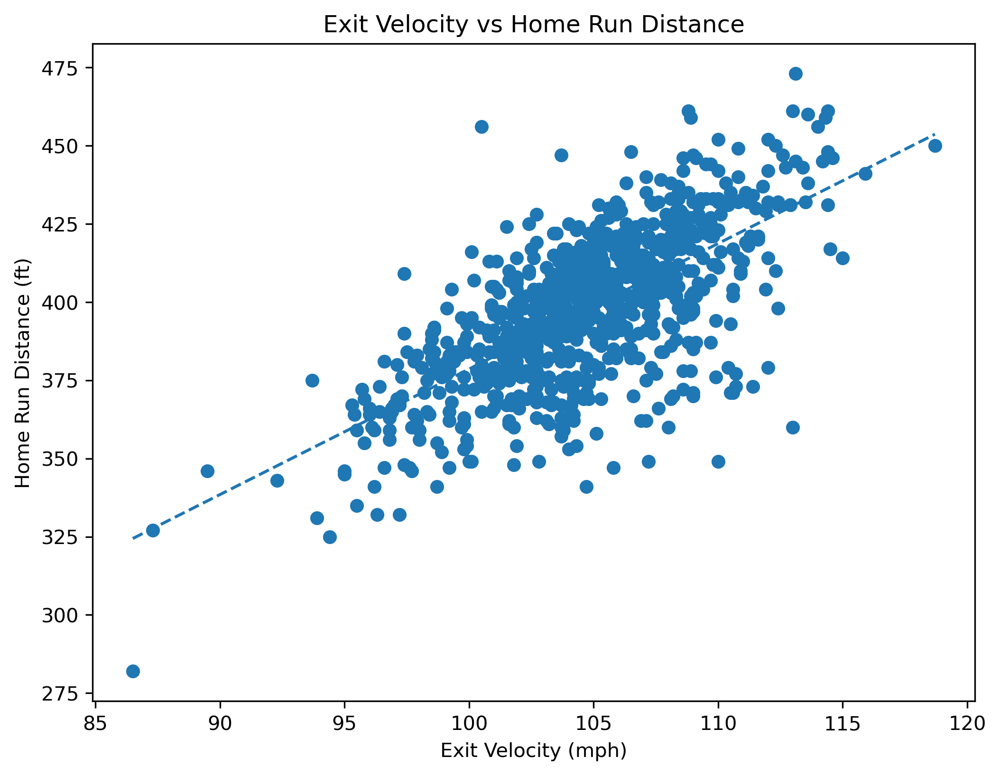
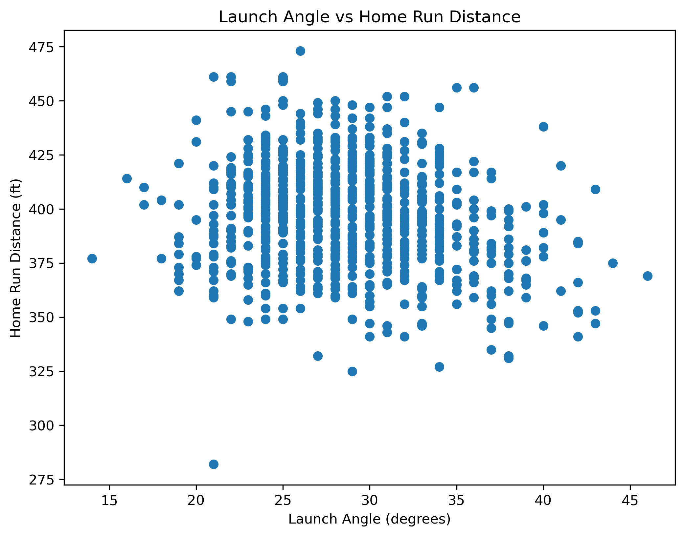
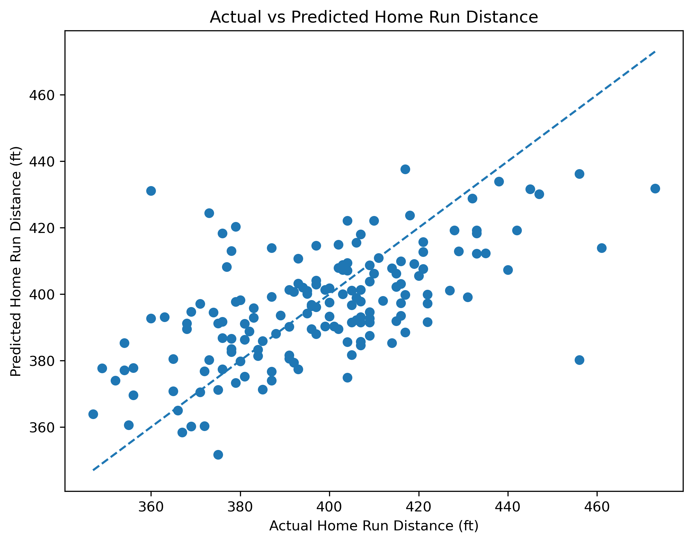

# MLB Home Run Distance Prediction Using Statcast Data

## Project Overview

This project analyzes MLB Statcast data to investigate the relationship between exit velocity, launch angle, and home run distance.

The project uses exploratory data analysis and linear regression models to evaluate whether exit velocity and launch angle can be used to predict how far a home run travels.

## Research Questions

1. How strongly is exit velocity related to home run distance?
2. How strongly is launch angle related to home run distance?
3. Does adding launch angle improve home run distance prediction beyond exit velocity alone?

## Dataset

The dataset was obtained from MLB Statcast data using the `pybaseball` Python package.

- **Time period:** April 2024
- **Total Statcast events:** 116,768
- **Home runs analyzed:** 796
- **Target variable:** Home run distance (ft)
- **Predictor variables:** Exit velocity (mph), launch angle (degrees)

## Methodology

The analysis consists of the following steps:

1. Collect MLB Statcast data from April 2024.
2. Filter the dataset to include home run events.
3. Perform exploratory data analysis.
4. Calculate correlations between the predictor variables and home run distance.
5. Build two linear regression models:
   - **Model 1:** Exit velocity
   - **Model 2:** Exit velocity + launch angle
6. Split the data into training and testing sets using an 80/20 split.
7. Evaluate model performance using R² and Mean Absolute Error (MAE).

## Results

### Correlation Analysis

- **Exit velocity:** r = 0.682
- **Launch angle:** r = -0.188

Exit velocity showed a substantially stronger linear relationship with home run distance than launch angle.

## Visualizations

### Exit Velocity vs Home Run Distance

### Launch Angle vs Home Run Distance

### Actual vs Predicted Home Run Distance

### Model Comparison

| Model | Test R² | MAE (ft) |
|---|---:|---:|
| Exit Velocity | 0.366 | 14.49 |
| Exit Velocity + Launch Angle | 0.369 | 14.49 |

Adding launch angle resulted in only a marginal improvement in predictive performance.

## Key Findings

Exit velocity appears to provide more useful linear predictive information for home run distance than launch angle in this dataset.

Adding launch angle to the model increased the test R² only slightly, from 0.366 to 0.369, while the MAE remained almost unchanged.

This suggests that additional variables may be needed to substantially improve home run distance prediction.

## Tools

- Python
- Jupyter Notebook
- pandas
- matplotlib
- scikit-learn
- pybaseball

## Conclusion

This project demonstrates how real-world MLB Statcast data can be used for exploratory data analysis, predictive modeling, and model comparison.

The analysis provides a simple example of applying data science techniques to baseball analytics.